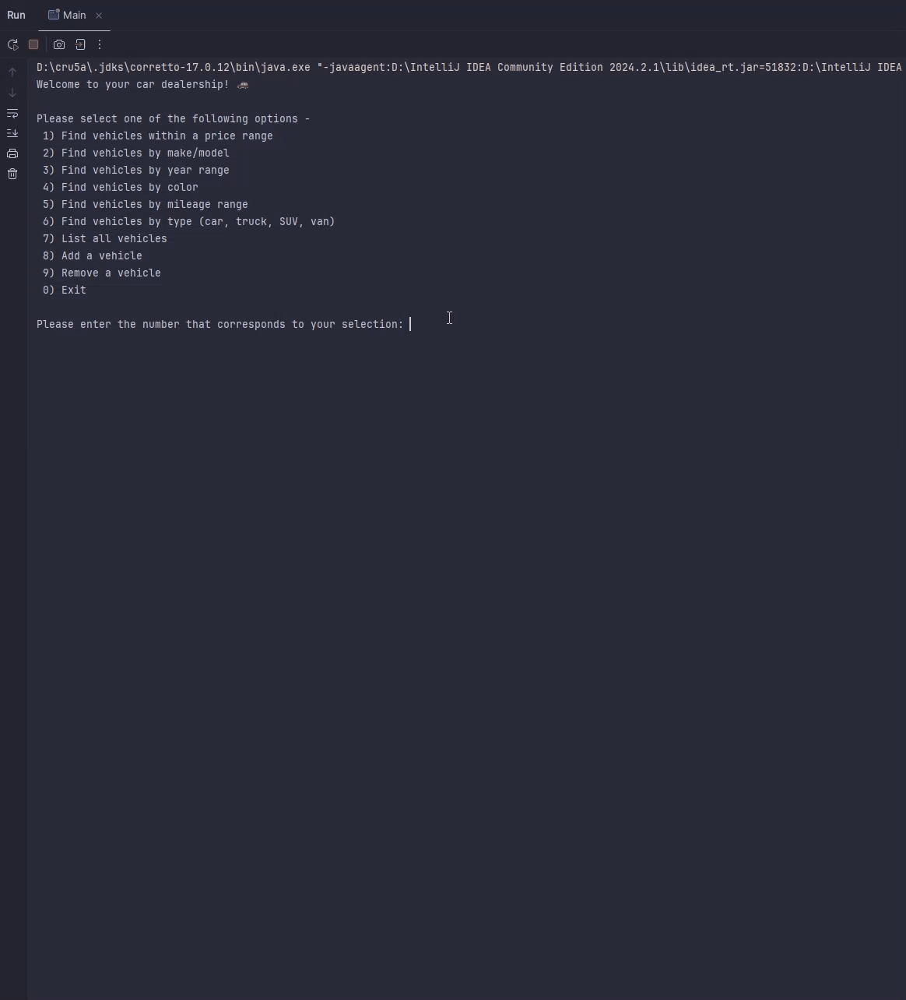

# Car Dealership Inventory Management Application

## Overview
This application helps users manage a car dealership’s inventory by enabling the addition, removal, viewing, and filtering of vehicles based on specific attributes. Written in Java, it provides an intuitive, console-based interface for interacting with the inventory, allowing users to search by criteria like price range, year, mileage, color, and vehicle type.

## Features

### Inventory Management
- Add new vehicles to the inventory with details such as VIN, make, model, type, color, odometer reading, and price.
- Remove vehicles by VIN to keep the inventory up-to-date.

### Search and Filter
- Easily search for vehicles by:
    - **Price Range**: Find vehicles within a specified price range.
    - **Make and Model**: Filter results by vehicle make and model.
    - **Year Range**: Display vehicles from within a specified year range.
    - **Color**: Search for vehicles by color.
    - **Mileage Range**: Filter vehicles by mileage range.
    - **Type**: Choose between cars, SUVs, trucks, and vans.

### User Experience
- Simple console-based navigation for smooth and clear interaction.
- Inventory changes are saved to a CSV file for data persistence across sessions.

### Input Validation
- Basic input checks to handle common errors, ensuring smooth user experience by prompting users for valid input when necessary.

## Project Structure

### Dealership Class
- Manages the dealership’s inventory and details. Includes methods for adding, removing, and searching vehicles by various attributes.

### Vehicle Class
- Encapsulates vehicle properties like VIN, make, model, type, color, odometer reading, and price.
- Provides getter and setter methods, and an overridden `toString()` method for formatted output.

### DealershipFileManager Class
- Manages reading from and writing to the `inventory.csv` file, storing dealership data across sessions.

### UserInterface Class
- Provides the console-based menu interface, handles user input, and interacts with `Dealership` to perform inventory operations.

### CSV File
- The `inventory.csv` file stores dealership information in a structured, pipe-separated format:

    - **Dealership Information**: `Dealership Name|Address|Phone`
    - **Vehicle Information**: `VIN|Year|Make|Model|Type|Color|Odometer|Price`

**Example:**

```plaintext
D & B Used Cars|111 Old Benbrook Rd|817-555-5555
54123|1993|Ford|Explorer|SUV|Red|525123|995.00
38764|2001|Ford|Ranger|Truck|Yellow|172544|1995.00
```

## Usage Instructions

### Main Menu Options
- Navigate the main menu to add, remove, view, and search vehicles in the inventory. Each option is clearly labeled for intuitive navigation.

### Adding a Vehicle
- Enter vehicle details (VIN, year, make, model, type, color, odometer reading, and price). The new vehicle is added to the inventory and saved to the CSV file.

### Removing a Vehicle
- Input the VIN of the vehicle to remove. The program verifies the VIN and removes the vehicle if it exists in the inventory, updating the data file.

### Viewing All Vehicles
- Displays a list of all vehicles currently in the inventory, showing each vehicle's make, model, type, color, odometer reading, and price.

### Searching the Inventory
- Use the following options to filter vehicles:
    - **By Price**: Enter a minimum and maximum price to view vehicles within that range.
    - **By Make and Model**: Specify both make and model to display matching vehicles.
    - **By Year**: Enter a minimum and maximum year to view vehicles from within that range.
    - **By Color**: Search by a specific color.
    - **By Mileage**: Set a minimum and maximum mileage to filter vehicles by odometer reading.
    - **By Type**: Choose a vehicle type (Car, SUV, truck, or van).

### Error Handling
- The program validates inputs to handle common errors, such as non-numeric entries for numeric fields, ensuring a smoother user experience by prompting users to re-enter data when necessary.

## Screenshots
Below are screenshots showcasing the different menus of the Car Dealership Inventory Management Application, along with a GIF demonstrating the display of all vehicles in the inventory.

### Main Menu


### Add Vehicle


### Remove Vehicle


### Display All Vehicles


## Notable Code

### Price Range Search Input Validation


This code snippet demonstrates input validation for the minimum price in the search by price functionality. The program prompts the user to enter a minimum price, checks if the input is a valid number, and continues to prompt until valid input is received:

```java
double minPrice;
while (true) {
    System.out.print("Enter min price: $");
    String minPriceInput = inptscnr.nextLine().trim();
    try {
        minPrice = Double.parseDouble(minPriceInput);
        break;
    } catch (Exception e) {
        System.out.println("\nInvalid amount. Please enter a valid number.\n");
    }
}
```

This loop ensures valid numeric input, helping prevent crashes or unexpected behavior due to incorrect data types.